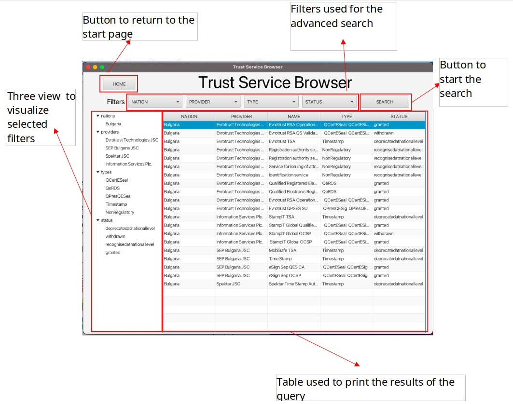

# TRUST SERVICES DASHBOARD BROWSER

**<u>Authors:</u>**  Alessandro Barel (alessandro.barel.1@studenti.unipd.it),

​                  Anna Giacomello (anna.giacomello@studenti.unipd.it),

​                  Damiano Salvaterra (damiano.salvaterra@studenti.unipd.it),

​                  Marco Giacomin (marco.giacomin.4@studenti.unipd.it)

#### Brief

TSD Browser is a desktop application that allows you to view, select, and reorder the trust services of European Countries. The list of services is retrieved from the API of [this](https://esignature.ec.europa.eu/efda/tl-browser/#/screen/home) EU site. 

This application is realized with Java and makes use of the JavaFX 18 GUI framework.

**<u>Requirements</u>**: this application needs Java 18 to run and an internet connection.

# Documentation

(All the UML diagrams have been drawn with Visual Paradigm Community Edition software)

## USE CASES

The application allows to perform a search for services based on filters or by selecting a Country. The use cases are presented below.

 

| NAME           |   Country Selection     |
|:--------------:|:----------------------|
| ACTOR          | User                 |
| DESCRIPTION    | The user must be able to view a list of European countries and select one of them. Once the user has selected a Country, they must be able to view all services that the selected country provides.        |
| PRECONDITIONS  | The application has correctly downloaded data from the API. The application shows the Home Page. |
| POSTCONDITIONS | The application shows the Result Page with services of the selected Country.           |

|       NAME       | Country-filter Selection                                     |
| :--------------: | :----------------------------------------------------------- |
|      ACTOR       | User                                                         |
|   DESCRIPTION    | The user must be able to select one or more Countries from a list to filter only interested Countries. |
|  PRECONDITIONS   | The application has correctly downloaded data from the API.  |
|  POSTCONDITIONS  | The application has updated the other selectable filters based on the filter just selected. |
| ALTERNATIVE FLOW | If the user doesn't select any filter, it is considered just like a "Select All" filter. |

|       NAME       | Provider-filter Selection                                    |
| :--------------: | :----------------------------------------------------------- |
|      ACTOR       | User                                                         |
|   DESCRIPTION    | The user must be able to select one or more providers from a list to filter only interested providers. |
|  PRECONDITIONS   | The application has correctly downloaded data from the API.  |
|  POSTCONDITIONS  | The application has updated the other selectable filters based on the filter just selected. |
| ALTERNATIVE FLOW | If the user doesn't select any filter, it is considered just like a "Select All" filter. |

|       NAME       | Type-filter Selection                                        |
| :--------------: | :----------------------------------------------------------- |
|      ACTOR       | User                                                         |
|   DESCRIPTION    | The user must be able to select one or more service type from a list to filter only interested types. |
|  PRECONDITIONS   | The application has correctly downloaded data from the API.  |
|  POSTCONDITIONS  | The application has updated the other selectable filters based on the filter just selected. |
| ALTERNATIVE FLOW | If the user doesn't select any filter, it is considered just like a "Select All" filter. |

|       NAME       | Status-filter Selection                                      |
| :--------------: | :----------------------------------------------------------- |
|      ACTOR       | User                                                         |
|   DESCRIPTION    | The user must be able to select one or more service status from a list to filter only interested service status. |
|  PRECONDITIONS   | The application has correctly downloaded data from the API.  |
|  POSTCONDITIONS  | The application has updated the other selectable filters based on the filter just selected. |
| ALTERNATIVE FLOW | If the user doesn't select any filter, it is considered just like a "Select All" filter. |

|      NAME      | Search by filter                                             |
| :------------: | :----------------------------------------------------------- |
|     ACTOR      | User                                                         |
|  DESCRIPTION   | The user must be able to perform a search for services based on the selected filters. |
| PRECONDITIONS  | The application has correctly downloaded data from the API. One or more filters has been selected by the user. |
| POSTCONDITIONS | The application prints out the result of the search queried by the user. |

|      NAME      | Sorting the services                                         |
| :------------: | :----------------------------------------------------------- |
|     ACTOR      | User                                                         |
|  DESCRIPTION   | The user must be able to sort the services by Country, or provider, or type, or status. |
| PRECONDITIONS  | The user is viewing the Result Page and the Result Table is not empty. |
| POSTCONDITIONS | the application reorders the results according to the selected criterion. |

## DOMAIN MODEL

## CLASS DIAGRAM

## INTERNAL BEHAVIOR

In this section we explain how the application works. The behavioral model has been divided in two parts: the first is the backend, that manges the initial query to the API and operates on requests of filtered services; the latter is the frontend, the GUI (realized with JavaFX Framework) that via the controller classes passes the requests to the backend.

### Backend Overview

Filter-management is done by a class, ServiceFilter, having as attributes four Optional\<List> objects, so that when an user selects, say, one or more Countries, these selections full the list of the associated Optional (each Optional represent a type of filter: Country, tsp, etc..). This filter is then passed to the backend, that responds with a complementary ServiceFilter object that represents the available selections given the filter already selected. These steps are repeated for each filter menu.

When the user clicks on the search button, the filter (can be made up of all previously selected filters) is passed to the backend through a getServices() method. This method creates a List of all services that matches the selected filters and passes it back to the GUI-controller.

In terms of internal backend behavior, the use case where the user selects a Country flag instead of selecting a filter is the same as filtering only by that Country and then query the database, so the process is the same. It's just a shortcut.

#### BACKEND SEQUENCE DIAGRAMS

<u>**Application init sequence diagram**</u>

|  |
| :----------------------------------------------------------: |
| *When the application starts, the GUI controller asks for a model instance (that is a singleton) to the ModelSpawner. Model spawner requests to the APIClient to query the remote API to retrieve data, and this returns the downloaded resources wrapped in a DatahHolder datatype. The ModelSpawner requests another dataset from the API through the APIClient's getCountryMap() method, that uses another API call to get all the country codes. Once the ModelSpawner has all it needs to initialize the database, it creates the ServiceDatabase singleton and passes it back to the Controller.* |

**<u>Filter selection sequence diagram</u>**

|  |
| :----------------------------------------------------------: |
| *When the user selects a filter, the controller instantiates four ServiceFilter objects, one per filter type, and asks to the ServiceDatabase for each complementary ServiceFilter, so that the view can print out the options available. The ServiceDatabase uses an algorithm to extract the parameters of the complementary filter and then calls a static method of the ServiceFIlter class that intantiates a ServiceFilter from four sets.* |

**<u>Search sequence diagram</u>**

|  |
| :----------------------------------------------------------: |
| *When the user clicks on the search button, the Controller creates a ServiceFilter object and passes it to the ServiceDatabase in the getServices() method. This method checks all the services and extracts each and every one that matches the filter. The database then returns a List of Service objects that is the result of the search.* |

### Frontend Overview

The front end of the application is composed of 2 pages: the start page, and the results page. Each one was developed using the model-view-controller pattern.

The start page is the first page the user is presented with, and allows the user to carry out a search using two different methodologies: the drop down menus, and the flags.

Using the drop down menus the user can make a more precise query choosing all the desired parameters, while the flags are used to make a quick search only filtering the origin country.

|  |
| :-------------------------------------------------------: |
|                       *Start Page*                        |

When the user performs a search the page is changed to show the user the results using a table, and the selected filters using a tree structure. In this page the use can modify the selected filters in the CCBs and perform a new query, this will update the values in the table and in the tree accordingly.

|  |
| :----------------------------------------------------------: |
|                        *Result Page*                         |

#### FRONTEND SEQUENCE DIAGRAMS

**<u>Start Page initialization sequence diagram</u>**

|  |
| :----------------------------------------------------------- |
| *When the user starts the program the view is loaded by the FXMLLoader, which also launches the initialize method in the controller and then creates an instance of the model (Service Database) using the ModelSpawner class. The controller then makes the following operations: first, it requests the controller 2 maps used for the conversion of the country and provider IDs to the respective names (points 9,10). Then, it adds an event handler to the CheckComboBoxes (drop down menus) used to implement the complementarity of the filters, and adds a Listerner to manage the “select all” choice (points 11,12). After that, it creates a filter (Service Filter) that contains all the possible selections and uses the data to initialize the CheckComboBoxes (points 13-16). Finally, for each nation that offers a service, creates a flag (Button) used for the quick search (points 17,18). The system is now ready to be used by the user.* |

**<u>Filter selection (from Start Page) sequence diagram</u>**

|             |
| :----------------------------------------------------------- |
| *The user can now use the CheckComboBoxes to select the desired filters. After the selection, when the drop down menu is closed a method is launched in the controller to get the complementary of the selected items. For each CCB it retrieves the selected items and with them it instantiates a ServiceFilter(1 for each CCb) that will be used to ask the controller for its complementary (point 3). After getting the 4 filters it intersects them to create the complementary of all the selections in the 4 CCBs and sets the values (points 5-9). It then resets the checked values to the ones selected by the user(point 9).* |

**<u>Search by filters (from Start Page) sequence diagram</u>**

|              |
| :----------------------------------------------------------- |
| *After the user selects the desired filter, they can start the query by pressing the search Button; this will launch the changeToSearchScene method in the controller. In this method the results page is loaded from the FXML and we obtain an instance of its controller(Points 3-5). Then the program will get the selection from the start page CCBs and set the same data in the ones in the results page using the initFilter method of the results page controller(points 6-8). It then will launch the getComplementaryFilter method to make sure that the CCBs contain the right data to continue the search in the other page. Finally, it will start the actual query and load the new page(Points 9,10).* |

<u>**Search by flag (from Start Page) sequence diagram**</u>

|               |
| :----------------------------------------------------------- |
| *The user can also make the search selecting a flag; this will check the correspondent country in the nation CCB and then make a search using the filters (the process is the same as before).* |

**<u>Result Page initialization sequence diagram</u>**

|  |
| :----------------------------------------------------------- |
| *The steps are the same of the start page initialization except for the creation of the flags.* |

**<u>Filter query (from Start Page) sequence diagram</u>**
|  |
| :----------------------------------------------------------- |
| *After the start page controller loads the results page controller, as we said it calls three of its methods: initFilter, which receives the checkModels from the startPage and sets the selected items in the CCBs of the results page (Points 1,2); getComplementaryFilter, which is the same as in the start page, it’s used to set the complementarity of the filters so the user can continue the query started in the start page; searchByFilters, which gets the selected items form the CCBs(points 3-5) and uses them to get the services from the model (points 6,7); it will then insert the selected filters in the treeView (Points 8-10), and print the services in the tableView(Points 11,12).* |

**<u>Filter selection (from Result Page) sequence diagram</u>**

|             |
| :----------------------------------------------------------- |
| *After seeing the results of the first query, the user can change the selected filters. This will cause the same sequences as in the start page.* |

**<u>Search by filters (from Result Page) sequence diagram</u>**

|  |
| :----------------------------------------------------------- |
| *After the user changes the filters he can start a new query by pressing search; this will launch the searchByFilter method, the same launched by the start page controller, and, as before, this will get the services from the model, print the filters in the treeView and the services tableView.* |

**<u>Return to Start Page</u>**

|  |
| :----------------------------------------------------------- |
| *The user can press the home button in the results page; this will launch the homeScene method in the controller, that will load the startPage using the FXMLLoader and then change the page using setScene.* |

## SYSTEM TEST CASES

| CASE TEST ID                  | TEST SCENARIO                                                | TEST CASE                                                    | TEST STEPS                                                   | EXPECTED RESULTS                                             | POST CONDITION                                               | STATUS |
| ----------------------------- | ------------------------------------------------------------ | ------------------------------------------------------------ | :----------------------------------------------------------- | ------------------------------------------------------------ | ------------------------------------------------------------ | ------ |
| **Country Selection**         | The user must be able to view a list of European countries and select one of them. Once the user has selected a country, they must be able to view all services that the selected country provides. | View a panel of flags representing the respective countries; select one country; go to the Results Page. | Click on the flag that corresponds to the desired country.   | Load of the results page. Creation of a table with the results compatible with the selected country. Creation of a TreeView showing the selected country. | The application shows the Results Page with services of the selected country. | PASS   |
| **Country-filter Selection**  | The user must be able to select one or more Countries from a list to filter only interested countries. | View a list of countries; select/deselect one or more countries.   If the user doesn't select any filter, it is considered just like a "Select All" filter. | 1. Open the drop down menu "NATION".   2. Select / deselect one or more countries. | The application updates the other filters showing only the options that are compatible with the selected countries. | The application has updated the other selectable filters based on the filter just selected. | PASS   |
| **Provider-filter Selection** | The user must be able to select one or more providers from a list to filter only interested providers. | View a list of providers; select/deselect one or more providers;   If the user doesn't select any filter, it is considered just like a "Select All" filter. | 1. Open the drop down menu "PROVIDER".   2. Select / deselect one or more providers. | The application updates the other filters showing only the options that are compatible with the selected providers. | The application has updated the other selectable filters based on the filter just selected. | PASS   |

| CASE TEST ID                | TEST SCENARIO                                                | TEST CASE                                                    | TEST STEPS                                                   | EXPECTED RESULTS                                             | POST CONDITION                                               | STATUS |
| --------------------------- | ------------------------------------------------------------ | ------------------------------------------------------------ | :----------------------------------------------------------- | ------------------------------------------------------------ | ------------------------------------------------------------ | ------ |
| **Type-filter Selection**   | The user must be able to select one or more service type from a list to filter only interested types. | View a list of types of service; select/deselect one or more types;   If the user doesn't select any filter, it is considered just like a "Select All" filter. | 1. Open the drop down menu "TYPE".   2. Select / deselect one or more types. | The application updates the other filters showing only the options that are compatible with the selected types. | The application has updated the other selectable filters based on the filter just selected. | PASS   |
| **Status-filter Selection** | The user must be able to select one or more service status from a list to filter only interested service status. | View a list of status; select/deselect one or more status;   If the user doesn't select any filter, it is considered just like a "Select All" filter. | 1. Open the drop down menu "STATUS".   2. Select / deselect one or more status. | The application updates the other filters showing only the options that are compatible with the selected status. | The application has updated the other selectable filters based on the filter just selected. | PASS   |
| **Search by filter**        | The user must be able to perform a search for services based on the selected filters. | Go to the Results Page once the "Search" button is clicked.  | Click on the "Search" button.                                | Load of the results page. Creation of a table with the results compatible with the selected filters. Creation of a TreeView showing the selected filters. | The application prints out the result of the search queried by the user. | PASS   |
| **Sorting the services**    | The user must be able to sort the services by Country, or provider, or type, or status. | Customed sorting of the results shown in the Results Page.   | Click on the desired field of the table.                     | Rearrangement of the results based on the selected field.    | The application reorders the results according to the selected criterion. | PASS   |