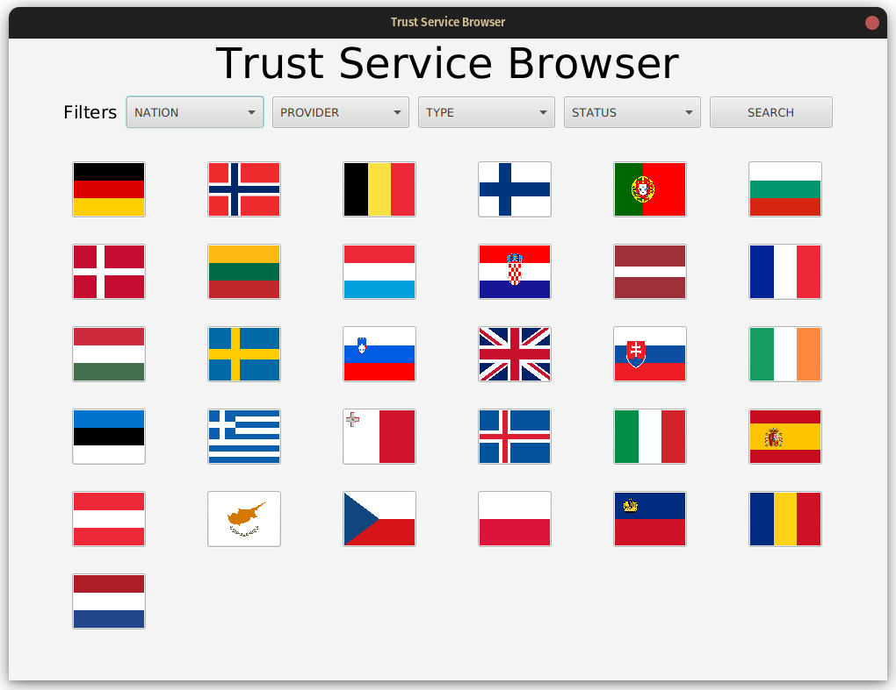
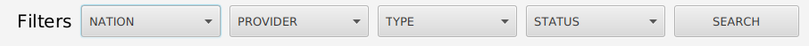
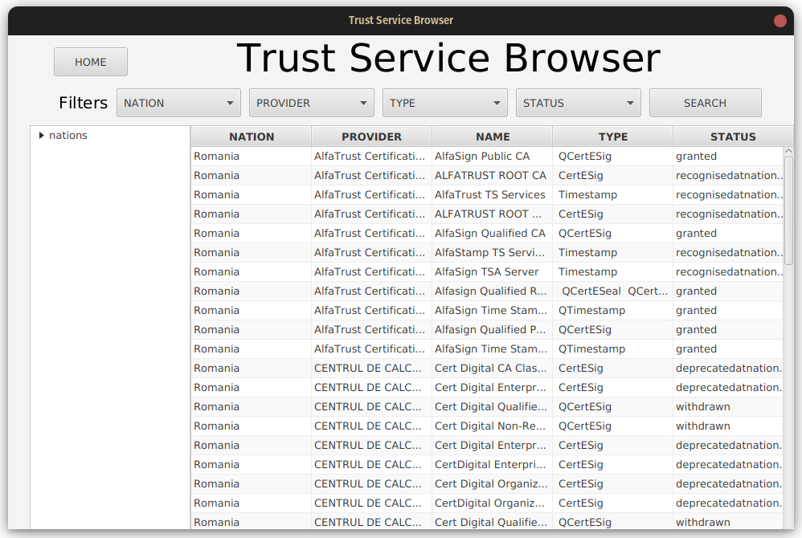

# Trusted Services Dashboard Browser
## User manual

What follows is a simple manual for the usage of our 
program (`tsd-browser`), which allows the user to browse and filter 
the european Trusted Service List.

---

## Overview

The **Trusted Service Browser** is a gui software designed to 
browse and perform search queries on the 
[EU trusted service list
](https://esignature.ec.europa.eu/efda/tl-browser/#/screen/home), 
a repository of certified providers of various digital services 
and certifications.  
The software is very simple to learn and to use, and is 
extensively documented.

This app is made possible by [the website's 
official API](https://esignature.ec.europa.eu/efda/swagger-ui.html#/)
and the data presented is unaltered from the one you

---

## Launching the program

The simplest way to launch the program is to download the 
release `jar`s for your operating system (available at 
[this google drive archive](https://drive.google.com/drive/u/1/folders/111Ufl503BJWrWKbe4ecP7LkENZYOoRU1))
and launch them 
using `java -jar [filename].jar`.  
You can also download the source code, open the root 
folder with Intellij Idea and run the app with it
(the project is organized 
using Maven, which will take some time on your first 
launch to download all your dependencies).

---

## The home screen

After a startup period that depends on local 
internet speed, this is the page that should appear. 
Just below the title of the app are the five topmost buttons, 
the primary ways to select your query filter, which will be 
described in a following paragraph.  
The bar is followed by a series of flags which, when clicked, 
will bring you to a result screen of all the services located 
in the corresponding country.

## The filters

Above the flags in the start page (and at the top of the 
results page) is a series of five buttons:  
<kbd>NATION</kbd> <kbd>PROVIDERS</kbd> <kbd>TYPE</kbd>
<kbd>STATUS</kbd> <kbd>SEARCH</kbd>

The first four buttons, when clicked, open a multiple choice 
drop-down menu. Inside a single menu, you can choose any 
combination of parameters, and they will apply on a logical OR 
basis (for a service to match the filter it's sufficient that 
at least one of these parameters is satisfied), or you can leave 
it empty to signal that you don't want to filter out any service 
based on that field.  
Selection between filter fields works like a logical AND: 
the service must match every non-empty field to match the 
whole filter.  
You will notice that, when first filling an empty menu, 
not every option originally present will be available. 
This is because the program automatically detects combinations 
which would not produce any results, and prevents you from 
creating them.

Pressing the <kbd>SEARCH</kbd> button will launch the search: 
the application will try to match the filter against every 
service, and will present those that succeeded in the result 
page.

## The result screen

This final screen displays the result of your query. The greater 
part of it is occupied by a scrollable table that presents every 
piece of data retrieved by the API on the service. 
The collapsible tree view on the left is a representation of 
your current query, and the top part is largely identical 
to the one in the starting screen, except for 
the <kbd>HOME</kbd> button, which allows you to quickly 
reset the program.

x
